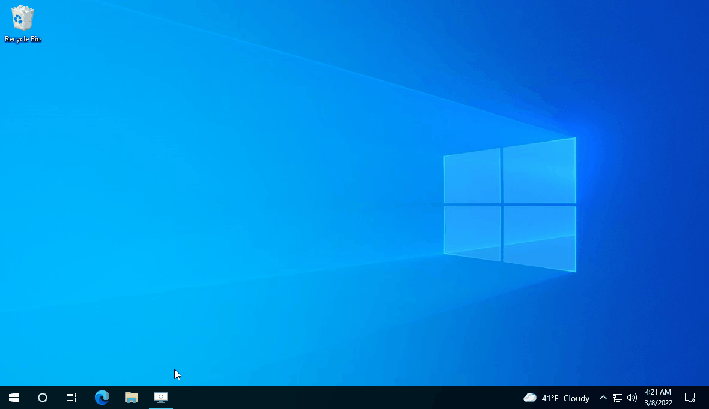
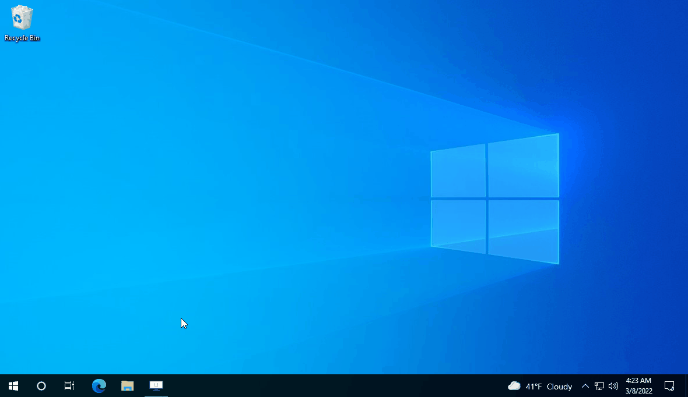
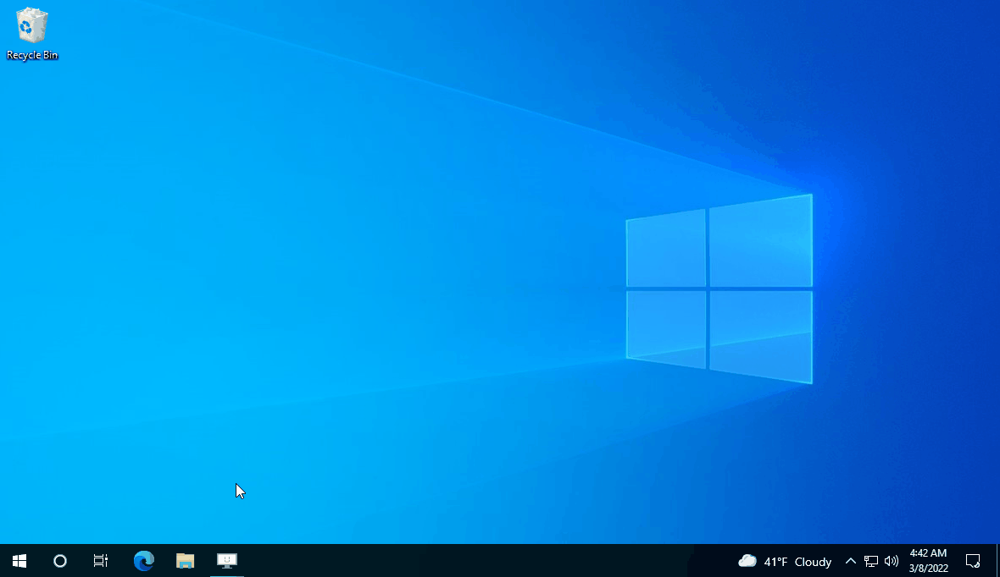
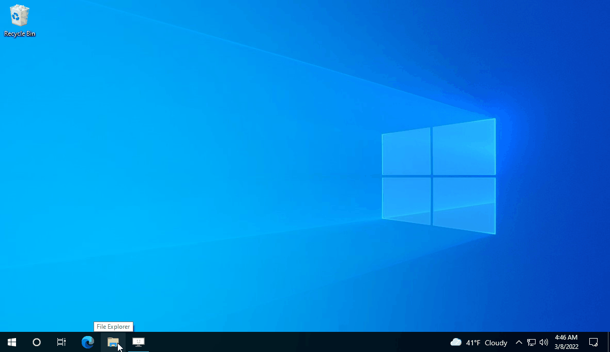
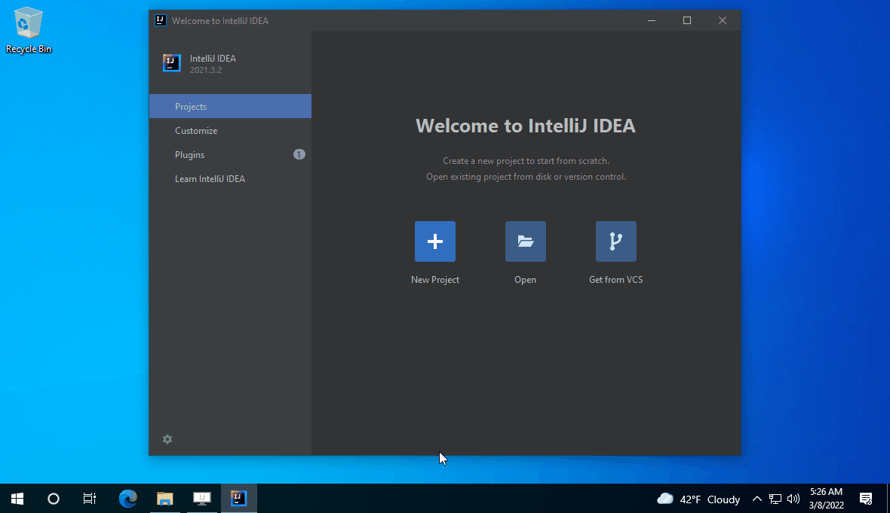
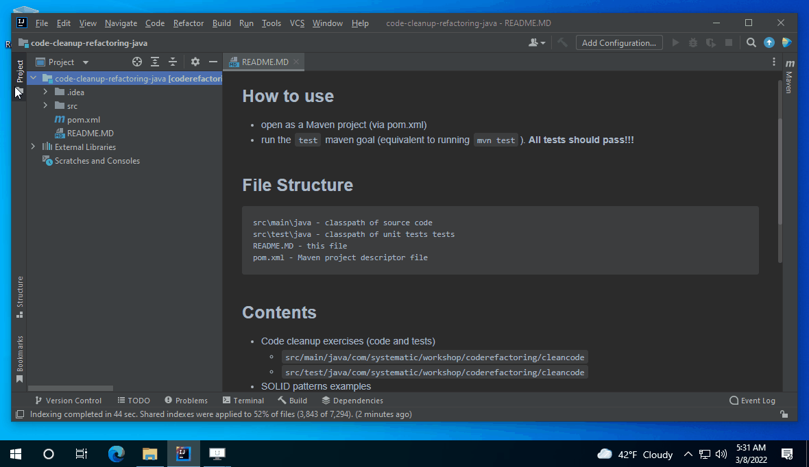
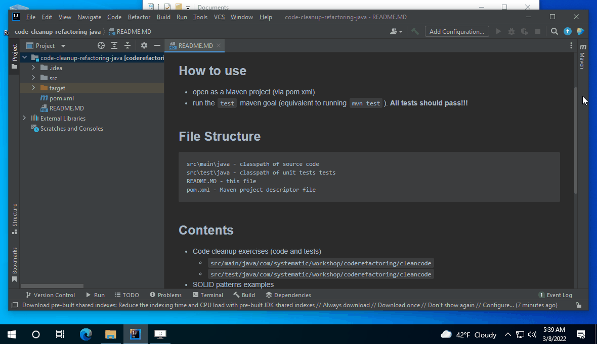

# Welcome to the Systematic Java Workshops!

## GENERAL INFO

This tutorial will work for Windows 10 x64 with Java 11+. If you have any other architecture or OS, let
us know **immediately**.

If you have Java 11+ and IntelliJ IDEA installed, you can skip steps 1 and 2 entirely.

If you have older versions of Java already installed, we recommend uninstalling them before moving on, unless you really
know what you're doing.

Finally, the coding exercises can be done on any other IDEs (VS Code, Eclipse, NetBeans, or even Notepad++ if you're
feeling brave), but we will provide limited support for those during the workshop.

## 1. DOWNLOAD TOOLS

- Java Azul Zulu JDK 11
    - [Latest .zip version](https://www.azul.com/downloads/?version=java-11-lts&os=windows&package=jdk)
- IntelliJ IDEA:
    - we
      recommend [Community Edition](https://www.jetbrains.com/idea/download/download-thanks.html?platform=windowsZip&code=IIC)
      since it's more than enough for Java SE.
    - you can also download
      the [Ultimate Edition](https://www.jetbrains.com/idea/download/download-thanks.html?platform=windowsZip) on a
      30-day trial.

## 2. Prepare development environment

We recommend a folder structure like:

- ```C:\systematic-workshops\```
- ```C:\systematic-workshops\software```
- ```C:\systematic-workshops\code```

It will make finding things easier.

### 2.0. Extract source code

- download  
- extract to ```C:\systematic-workshops\code```
- exact name of zip file may depend on your specific workshop.


### 2.1. Install JDK

#### 2.1.1. Extract

- Extract the archive to ```C:\systematic-workshops\software\archive_name``` such that ```java.exe``` is
  in ```C:\systematic-workshops\software\archive_name\bin\```

We will refer to ```C:\systematic-workshops\software\archive_name``` as ```JAVA_HOME```.



#### 2.1.2. Environment variables

- copy the JDK extraction path to clipboard
- open Environment Variables for your user
- create a new variable called ```JAVA_HOME``` with the value equal to what's in the clipboard. *Make sure* it does not
  have any trailing slashes.
- edit the PATH variable - add a line with ```%JAVA_HOME%\bin```



#### 2.1.3. Verify

- Close all command lines and close all other applications.
- Open a command line, write and run ```java -version```. You should get a result as follows:
  

### 2.2. OBLIGATORY CAT BREAK


### 2.3. Install IntelliJ IDEA

#### 2.3.1. Extract IntelliJ IDEA

- create a new folder for IDEA: C:\systematic-workshops\software\IntelliJ-IDEA
- extract the archive to ```JAVA_HOME``` such that ```java.exe``` is in ```%JAVA_HOME%\bin\```
  

#### 2.3.2. Run IntelliJ IDEA

- run C:\systematic-workshops\software\IntelliJ-IDEA\bin\idea64.exe
  

### 2.3.3. Configure IntelliJ IDEA

- accept License agreement
- don't send any data to Jetbrains - unless you want to.

## 3. Open and test the project

### 3.1. Open project

- (re)run IntelliJ IDEA
- select ```Open ```
- navigate to the ```pom.xml``` file in the source code root folder and "open" the ```pom.xml``` project
- wait for indexing operations to finish (see taskbar, bottom-right)
  

### 3.2. Configure JDK

- go to ```File - Project Structure```
- set ```SDK``` to ```11 Azul Zulu```
- set ```Language level ``` to ```11```

**Note:** if you can't see the SDK, go to the ```SDKs``` tab on the left, press the ```+``` sign - ```Add JDK...``` and
navigate to ```JAVA_HOME```. Afterwards, do the steps above.



### 3.3. RUN!!

- open the ```Maven``` tab on the right
- expand ```Code Refactoring Workshop / Lifecycle```
- double-click ```test```
- you should get a ```BUILD SUCCESS``` output below the source code section. First run will be slower; the next runs
  will be much faster.
-



## 4. OVERVIEW OF FOLDERS

This is an overview of all the relevant paths of the environment.

| Key           | Description                                            | Example value                                        |
|---------------|--------------------------------------------------------|------------------------------------------------------|
| WORKSHOP_ROOT | The root of all things                                 | C:\systematic-workshops                              |
| SOFTWARE_ROOT | Where most or all the used software is installed       | %WORKSHOP_ROOT%\software                             |
| CODE_ROOT     | Where the code is  downloaded                          | %WORKSHOP_ROOT%\code                                 |
| JAVA_HOME     | Where the JDK is extracted                             | %SOFTWARE_ROOT%\zulu11.54.25-ca-jdk11.0.14.1-win_x64 |
| INTELLIJ_HOME | Where IntelliJ IDEA is extracted                       | %SOFTWARE_ROOT%\IntelliJ-IDEA                        |
| Path          | Env var provided by Windows - we add the java folder   | %JAVA_HOME%\bin                                      |
